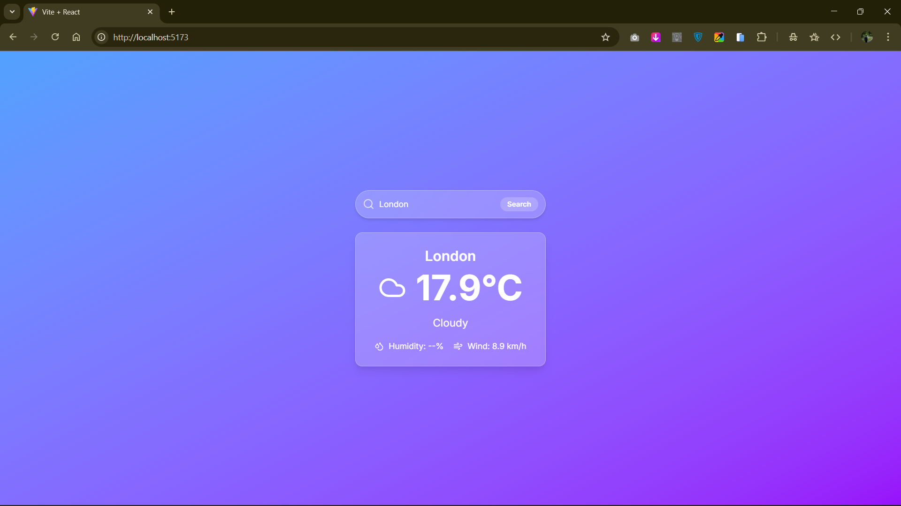
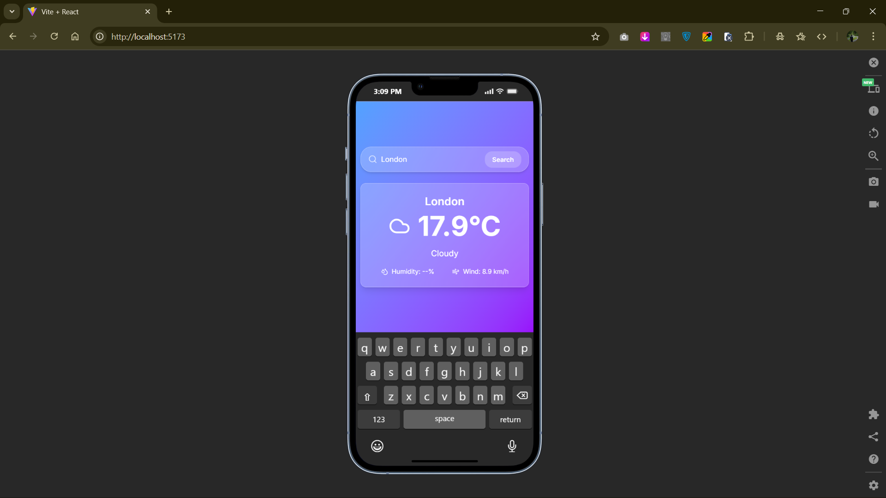

# Weather Web Application 🌤️

## Project Description

**WeatherNow** is a modern, responsive web application that allows users to check the current weather of any city in the world. The app features a sleek UI with glassmorphism design using **Tailwind CSS**, providing an intuitive experience for users to search and view weather data in real-time.

---

## User Features

-   Search for any city worldwide to get the current weather.
-   Displays temperature, weather conditions, wind speed, and humidity.
-   Responsive and visually appealing design using **glassmorphism**.
-   Real-time weather updates fetched from a reliable API.
-   Smooth user experience with loading states and error handling.

---

## Technology Stack

-   **Frontend:** React.js
-   **Styling:** Tailwind CSS
-   **Weather API:** [Open-Meteo API](https://open-meteo.com/)
-   **Icons:** Lucide React
-   **State Management:** React Hooks (useState, useEffect)

---

## Installation Instructions

1. **Clone the repository**

```bash
git clone https://github.com/Rajugit07/Weather-App.git
cd weather-web-app

2. Install dependencies
npm install

3. Run the development server
npm run dev


4. Open your browser and visit http://localhost:5173 to view the app.


Usage Instructions

1. Enter the name of a city in the search bar.
2. Press Enter or click the Search button.
3. The app will display:
    - Current temperature in Celsius
    - Weather condition with an icon
    - Additional information such as humidity and wind speed
4. If the city is invalid or the API fails, a user-friendly alert will notify the user.

```

## Screenshots

<p float="left">
  
  
</p>

## API Reference

-   Open-Meteo API: Free weather API providing current weather and geocoding.
-   Endpoints used:
    https://geocoding-api.open-meteo.com/v1/search?name={cityName} → Get latitude and longitude for a city

    https://api.open-meteo.com/v1/forecast?latitude={lat}&longitude={lon}&current_weather=true → Get current weather data

## Author / Contact

    - Developer: Rajugit07
    - GitHub: https://github.com/Rajugit07
